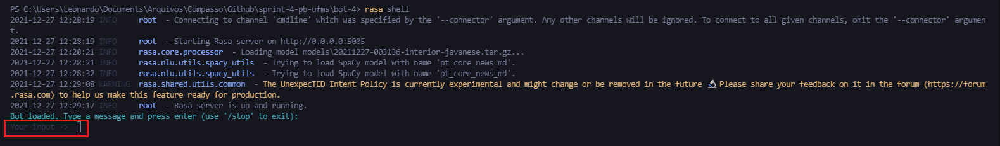
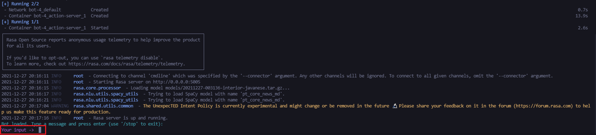
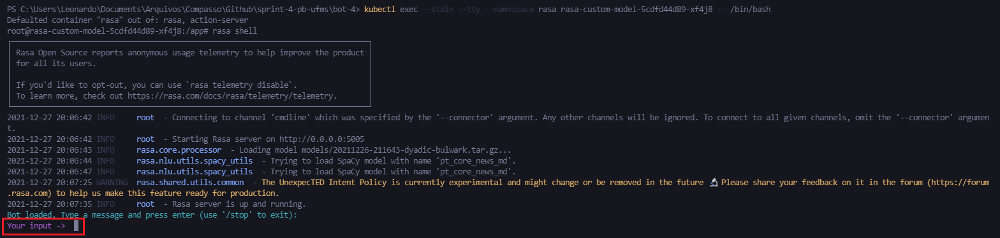
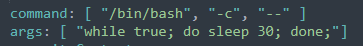

# sprint-4-pb-ufms
Quarta sprint do programa de bolsas Compass.uol para formação em chatbot Rasa.

---
# Tabela de conteúdos:
- [Objetivo do projeto](#objetivo-do-projeto)
- [Uso do Chatbot](#uso-do-chatbot)
  * [Uso padrão](#uso-padrão)
  * [Uso com Docker :whale2:](#uso-com-docker)
- [Desenvolvimento](#desenvolvimento)
  * [Bibliotecas e tecnologias utilizadas](#bibliotecas-e-tecnologias-utilizadas)
  * [Criação do chatbot](#criação-do-chatbot)
  * [Criação do Dockerfile/Docker-Compose](#criação-do-dockerfile/docker-compose)
- [Dificuldades encontradas](#dificuldades-encontradas)
  * [Reconhecimento de entidades](#reconhecimento-de-entidades)
  * [Uso em Docker - problemas de permissão](#uso-em-docker---problemas-de-permissão)
  * [Uso em Kubernetes](#uso-em-kubernetes)

# Objetivo do projeto
O objetivo do projeto é criar um Chatbot em RASA, que efetua a comunicação com uma API. A API utilizada é a Lyrics.ovh, para busca de letras de músicas.

---
# Uso do Chatbot
## Uso padrão
Para conversar com o bot, é necessário possuir o Python instalado em sua máquina, preferencialmente na versão 3.8, mesma utilizada no desenvolvimento do projeto.
Com o Python instalado, você terá acesso ao *pip*, que é seu instalador de pacotes.

Este chatbot utiliza o framework RASA, bem como o pacote de linguagem natural spaCy, com o modelo ```pt_core_news_md```. Para facilitar a instalação, existe um arquivo ```requirements.txt``` que já possui todas as dependências que devem ser instaladas. Sendo assim:

1. Abra seu terminal na pasta "bot-4"
2. Digite ```pip install -r requirements.txt```

Feito isso, você já terá todas as dependências necessárias para utilizar o bot.

Para iniciar a conversa, digite o comando ```rasa shell```, e aguarde o carregamento. Estará pronto quando o terminal indicar que está aguardando sua mensagem.


## Uso com Docker :whale2:
Caso você possua o Docker instalado, a instalação pode ser um pouco facilitada. O Docker permite que você utilize uma imagem configurada exatamente para o uso deste chatbot, não sendo necessário baixar o Python e suas dependências.

Para executar com o docker:
1. Com o _Docker daemon_ já em execução, execute seu terminal na pasta "bot-4"
2. Digite o comando: ```docker-compose run -u "root" rasa```. Este comando executará o serviço RASA, que é o chatbot. Este serviço tem como dependência o servidor das ações, que será executado automaticamente.

Á partir daí,  basta aguardar o carregamento. Estará pronto quando o terminal indicar que está aguardando sua mensagem.


---
# Desenvolvimento
## Bibliotecas e tecnologias utilizadas
- Python
- RASA
- spaCy
- MongoDB (Pymongo)
- Docker
- Kubernetes

## Criação do chatbot
O chatbot é criado a partir do framework [RASA](https://rasa.com/). O framework funciona com diversos arquivos YAML, entre eles o arquivo NLU e Domain, que definirão os padrões de Linguagem Natural e de Respostas, a serem aprendidos pelo bot.

Como o objetivo era a busca de letras de músicas, foi definido diversos padrões em frases para este intuito, como por exemplo "Gostaria da letra de uma música", e "quero encontrar a letra de uma musica".

Ainda, para melhor reconhecimento de Entidades (nome de artistas e músicas), foi criada uma tabela de apoio (Lookup Table), contendo aproximadamente 500 artistas e 50 músicas mais ouvidos no Spotify.

As entidades são extraídas por meio de _forms_, que preenchem os _slots_ necessários. Os slots preenchidos são passados para um trecho de código em Python que efetua de fato a comunicação com a API, chamado Action.

Dentro da Action, ocorre também a comunicação com o banco de dados MongoDB, que guarda o valor retornado da pesquisa do usuário (a letra da música em sí).

Além disso, o bot possui também um _form_ para captura de nome do usuário. O bot possui também algumas _intents_ apenas para descontrair, como uma conversa natural.

## Criação do Dockerfile/Docker-Compose
Apesar de existir imagens oficiais do RASA, este bot específico utiliza o NLU spaCy, com o modelo `pt_core_news_md` (como já mencionado), que não está presente nas imagens oficiais. Sendo assim, foi criada uma imagem específica com o conteúdo necessário para rodar este chatbot, disponível no meu _repo_ do Dockerhub.

A imagem é baseada em um terminal do Python 3.8. A partir dalí, o ponto de entrada é justamente o terminal, onde é então possível fazer a chamada ao "```rasa shell```", iniciando o bot, bem como o "```rasa run actions```" para início do servidor de ações. Ambos iniciam automaticamente ao dar o comando ```docker-compose run```, com o usuário Root.


---
# Dificuldades encontradas
## Reconhecimento de entidades
Por não usarem algum tipo de padrão específico, o bot não conseguia distinguir com clareza a intenção de informar um Artista ou um nome de Música, quando os mesmos eram digitados sem um contexto (como por exemplo "Numb" ao invés de "Quero a letra da música chamada Numb"). 

Sendo assim, a solução que encontrei foi criar um padrão para o input dessas entidades. Para informar a música, é necessário digitar entre o símbolo de (+), da seguinte maneira: ```+Música desejada+```

Da mesma maneira, para informar o artista, é necessário digitar o símbolo de (-), da seguinte maneira: ```-Artista desejado-```.

Isso tudo é informado pelo bot de uma maneira simpática, para que amenize o sentimento do usuário de estar conversando com uma máquina.
Apesar de isto ter tirado um pouco do aspecto orgânico do bot, porém, está funcionando muito melhor.

## Uso em Docker - problemas de permissão
Por algum motivo, ao executar o comando ```docker-compose up```, mesmo tendo sido definido o usuário root, ou 1001 nas configurações, o pip encontrava erro de permissão ao tentar instalar os requerimentos. Ainda, algumas vezes, o próprio RASA encontrava erro de permissão ao executar alguns comandos iniciais, impossibilitando o uso.

Isso foi solucionado usando o comando já dito acima ```docker-compose run -u "root" rasa```, que força a execução com o usuário root. Assim, tudo funciona normal

## Uso em Kubernetes
Para o uso em Kubernetes, foi necessário instalar o instalador de pacotes Go, para então efetuar a instalação do pacote Kind. Devido ao trabalho para o usuário, resolvi nem mencionar na parte de "Uso" deste README.

Para a execução do kubernetes, com o terminal aberto na pasta "bot-4", é necessário executar os seguintes comandos:

1. ```kind create cluster```
2. ```kubectl cluster-info --context kind-kind```
3. ```kubectl create namespace rasa```
4. ```kubectl --namespace rasa apply -f manifest.yaml```
5. ```kubectl --namespace rasa get pods ``` -> Neste passo, aproveite para anotar o nome do seu cluster.
6. ```kubectl exec --stdin --tty --namespace rasa (nome do seu modelo) -- /bin/bash``` -> Isso executará o terminal dentro do seu cluster
7. Daí, basta executar ```rasa shell``` para iniciar a conversação com o bot. O container de ações executa de forma automática ao iniciar o cluster.



Uma das dificuldades encontradas foi justamente uma maneira de acessar o terminal por meio do cluster, uma vez que, caso eu informasse para o container rodar o "rasa shell", ele executaria, porém eu não teria acesso ao terminal para fazer o _input_ das mensagens. Ainda, a porta 5005 ficaria em uso, impossibilitando que eu acessasse seu terminal externamente para executar o "rasa shell" novamente.

A solução para isso foi pedir para que o container execute um `bash`, de forma contínua, por meio dos argumentos no ```manifest.yaml```


